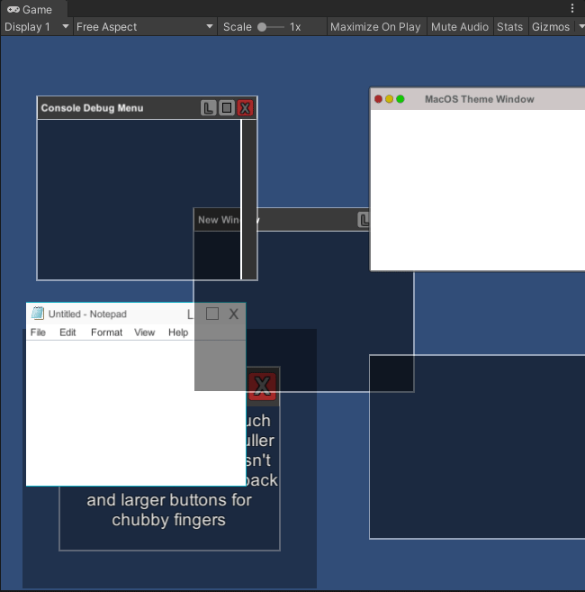

# unity-gui-windows
Draggable and scalable modular Canvas based GUI windows

To quickly create a window from hierarchy panel: Create > UI > Window

Draggable GUI Windows has been designed in a very modular way with ease of access for modifying both form and function.

We achieve this with 5 scripts:

GUIWindowUtils.cs:
------------------
This is a static class used for referencing mechanics outside of basic function. From here we have two functions:

GUIWindowUtils.InstantiateWindow() : This is the Create Menu hook to allow us to generate quickly
GUIWindowUtils.NewWindow()         : This will create a new window, trying to find a Canvas - can be called at runtime or from editor - previous function calls this

GUIWindow.cs:
-------------
This class exists simply to close a window. The nly function is CloseWindow() which called a Destroy()

GUIWindowExpander.cs:
---------------------
This is the class that we use to handle maximising the window. There are three public functions that you may want to reference here:

SetIsLocked()    : Make it so we can't use the expander at all
MaximiseWindow() : Expand window to full size of canvas
Minimisewindow() : Shrink window own to original size before expanding

This script needs to reference a RectTransform to enact the expand on
This script can be double clicked to invoke when "doubleClick" is set to true

There are two events you can use to avoid making direct script changes:

OnMinimised : Called once minimise has been finished
OnMaximised : Called once maximise has been finished

GUIWindowHandle.cs:
-------------------
This is the class we use to be able to drag the windows around form the edges. Each window generally has 8 of these for; top, bottom, left, right, top-right, top-left, bottom-right, bottom-left
You can assign a cursor here to display whenever this handle is hovered over. You will need to define if this is a horizontal, vertical or diagonal handle and calculations will be done from there based on positions

There one public function for reference here:

SetIsLocked() : Make it so we can't use this handle at all

There is one event you can use to avoid making direct script changes:

OnWindowPulled : Called once pointer is up after dragging handle about

GUIWindowMover.cs:
------------------
This is the class that handles moving a window across the screen without any size changes. This script is relatively simple in function and has one public function for reference:

SetIsLocked() : Make it so we can't use this mover at all

There is one event you can use to avoid making direct script changes:

OnWindowMoved : Called once pointer is up after moving window about

GUIPointerObject.cs:
--------------------
This class handles all pointer functions and can be extended for use in any other GUI script. 

There are four events you can use to avoid making direct script change:

OnPointerUp		: Called once mouse is over target and button is up
OnPointerDown	: Called once mouse is over target and button is down
OnPointerEnter	: Called when pointer intersects target
OnPointerExit	: Called when pointer leaves target

This script will require a UI component on the same object (Image, Text, etc) to raycast against

--------------------------------------------------------------------------------------------------------------------------------------------------------------------------------------
--------------------------------------------------------------------------------------------------------------------------------------------------------------------------------------
--------------------------------------------------------------------------------------------------------------------------------------------------------------------------------------

The windows are designed in such a way that the majority of the functionality is implemented via the buttons found in the UI menu rather than via script. Buttons call most events.

Each Example window contains the following buttons:

Close: Destroy the Window
Min/Maximise: Toggle full screen
Lock: Stop interaction with all window deformations to lock it in place

These buttons can be deleted if you don't want this content, along with the MenuBar and any other script you don't feel your project needs. You can keep these windows as simple as you like.

Mono scripts will all use various Pointer events to detect mouse inputs because buttons are "Mouse Down and Mouse Up", which isn't always ideal.

Enjoy! (:
